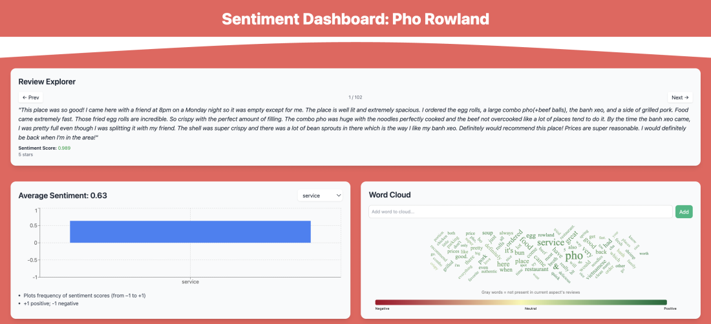

## ShowsSentiments
Sentiment analysis of Pho Rowland, a friend's successful restaurant's Yelp reviews with VADER, aspect‑based scoring, and interactive visualizations

- End‐to‐end sentiment‐analysis pipeline for Pho Rowland’s Yelp reviews. 
- scrapes Yelp review text, computes overall and sentence‐level sentiment with VADER
- performs aspect‐based sentiment extraction (food, service, price, etc)
- dashboard of interactive plots (violin‐plots, bubble charts, co‐occurrence maps)

=> For actionable insights

## Preview:

## Tools Used
- **React** – Interactive frontend dashboard
- **Tailwind CSS** – Component styling and layout
- **Plotly.js** – Violin plots and bubble charts
- **Recharts** – Bar chart visualizations
- **Framer Motion** – UI transitions
- **Vercel** – Frontend deployment
- **PapaParse** – Client-side CSV parsing
- **Python** (Jupyter Notebook) – Sentiment and aspect analysis
- **VADER Sentiment** – Review-level sentiment scoring
- **NRC Emotion Lexicon** – Fine-grained emotional scoring
- **Selenium** – Initial data scraping
- **Altair / Dash** – Early prototyping and validation

## Files
- `sentiment_analysis.ipynb` – Core NLP analysis in Python (VADER, aspect scoring)
- `cleaned_sentiment.csv` – Output of cleaned, structured sentiment data for dashboard
- `scraper.py` – Yelp review scraper using Selenium (run locally)
- `requirements.txt` – Python dependencies (for analysis and scraping)
- `src/` – React components for the dashboard (charts, word cloud, explorer, etc.)
- `public/` – Static assets (e.g., images, sentiment visuals)
- `package.json` – Frontend dependencies and build instructions
- `.vercelignore` – Ensures Python files don't interfere with Vercel deployment
- `tailwind.config.js` / `postcss.config.js` – Tailwind setup
